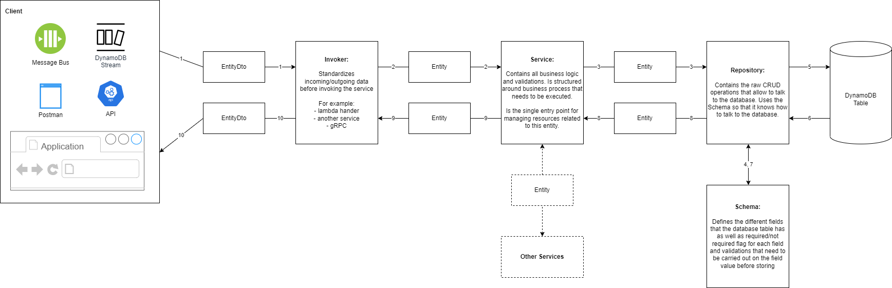

# Description
This repository contains an example on how to use the Dynamoose library (https://dynamoosejs.com/getting_started/Introduction) to communicate with DynamoDB.

# Illustration
The diagram below illustrates the different components and how they interact with each other:



# Setup
1. Setup AWS & Serverless, make sure you have an .aws directory in your user home folder that contains your credentials and config.
2. Duplicate the .env.template file based on the stage and set the variable values:
    ```sh
    cp .env.template .env.<stage>
    vim .env.<stage>
    ```
    for example:
    ```sh
    cp .env.template .env.personal
    vim .env.personal
    ```

3. Install dependencies in the root folder:
    ```sh
    npm i
    ```

4. Install dependencies for each app in the apps folder:
    ```sh
    cd apps/<app_name>
    npm i
    ```
    for example:
    ```sh
    cd apps/comments
    npm i
    ```

# Deploying the Database to AWS
1. Run the following command:
    ```sh
    npm run deploy --stage=<stage> --application=db
    ```
    for example:
    ```sh
    npm run deploy --stage=personal --application=db
    ```

# Running a Single Application Locally
1. Go to the apps folder and run the following command:
    ```sh
    cd apps/<app_name>
    npm run dev --stage=<stage>
    ```
    for example:
    ```sh
    cd apps/comments
    npm run dev --stage=personal
    ```

# Links

* Dynamoose Documentation: https://dynamoosejs.com/
* NestJS Dynamoose Implementation: https://blog.logrocket.com/nestjs-data-dynamoose/
